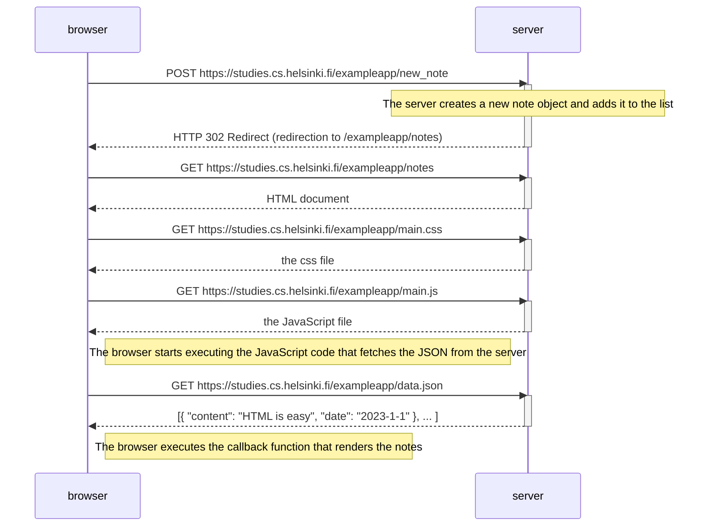
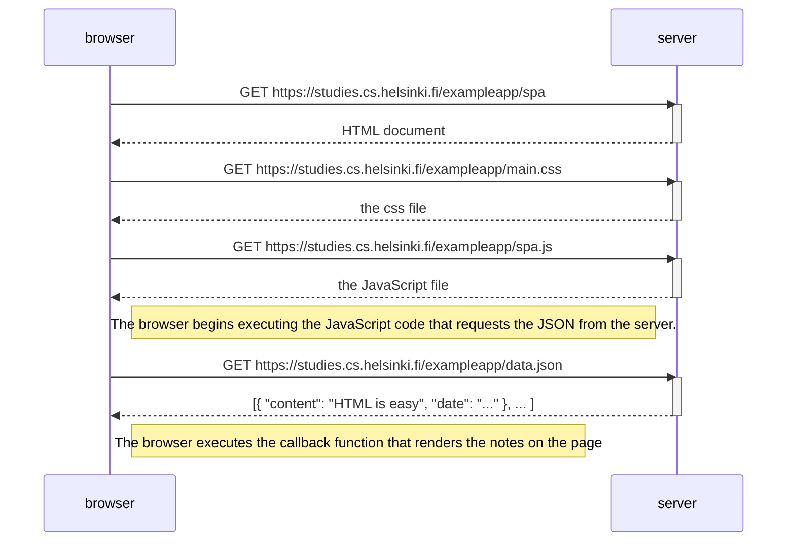
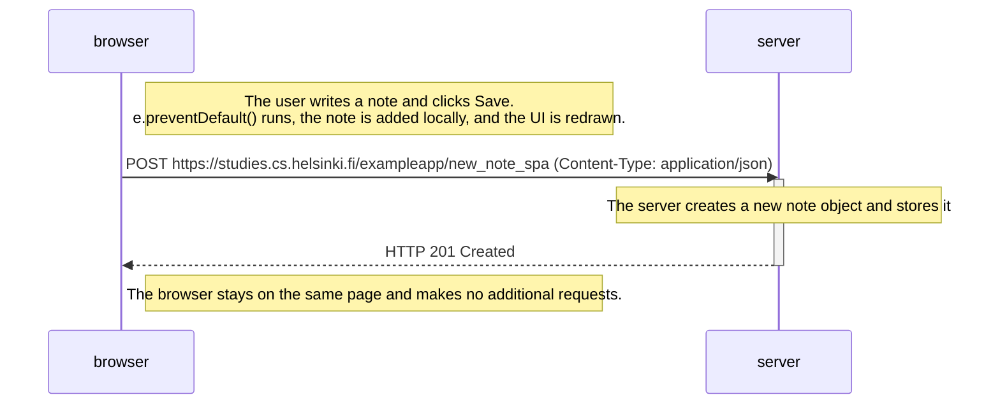

**Ejercicio 0.4: Creación de una nueva nota**

```mermaid
sequenceDiagram
    participant browser
    participant server

    browser->>server: POST https://studies.cs.helsinki.fi/exampleapp/new_note
    activate server
    Note over server: The server creates a new note object and adds it to the list
    server-->>browser: HTTP 302 Redirect (redirection to /exampleapp/notes)
    deactivate server
    
    browser->>server: GET https://studies.cs.helsinki.fi/exampleapp/notes
    activate server
    server-->>browser: HTML document
    deactivate server

    browser->>server: GET https://studies.cs.helsinki.fi/exampleapp/main.css
    activate server
    server-->>browser: the css file
    deactivate server

    browser->>server: GET https://studies.cs.helsinki.fi/exampleapp/main.js
    activate server
    server-->>browser: the JavaScript file
    deactivate server

    Note right of browser: The browser starts executing the JavaScript code that fetches the JSON from the server

    browser->>server: GET https://studies.cs.helsinki.fi/exampleapp/data.json
    activate server
    server-->>browser: [{ "content": "HTML is easy", "date": "2023-1-1" }, ... ]
    deactivate server

    Note right of browser: The browser executes the callback function that renders the notes
```
**Ejercicio 0.5:  Diagrama de aplicación de una sola página**

```mermaid
sequenceDiagram
    participant browser
    participant server

    browser->>server: GET https://studies.cs.helsinki.fi/exampleapp/spa
    activate server
    server-->>browser: HTML document
    deactivate server

    browser->>server: GET https://studies.cs.helsinki.fi/exampleapp/main.css
    activate server
    server-->>browser: the css file
    deactivate server

    browser->>server: GET https://studies.cs.helsinki.fi/exampleapp/spa.js
    activate server
    server-->>browser: the JavaScript file
    deactivate server

    Note right of browser: The browser begins executing the JavaScript code that requests the JSON from the server.

    browser->>server: GET https://studies.cs.helsinki.fi/exampleapp/data.json
    activate server
    server-->>browser: [{ "content": "HTML is easy", "date": "..." }, ... ]
    deactivate server

    Note right of browser: The browser executes the callback function that renders the notes on the page
```
**0.6: Nueva nota en diagrama de aplicación de una sola página**

```mermaid
sequenceDiagram
    participant browser
    participant server

    Note right of browser: The user writes a note and clicks Save.<br/>e.preventDefault() runs, the note is added locally, and the UI is redrawn.

    browser->>server: POST https://studies.cs.helsinki.fi/exampleapp/new_note_spa (Content-Type: application/json)
    activate server
    Note over server: The server creates a new note object and stores it
    server-->>browser: HTTP 201 Created
    deactivate server

    Note right of browser: The browser stays on the same page and makes no additional requests.
```
